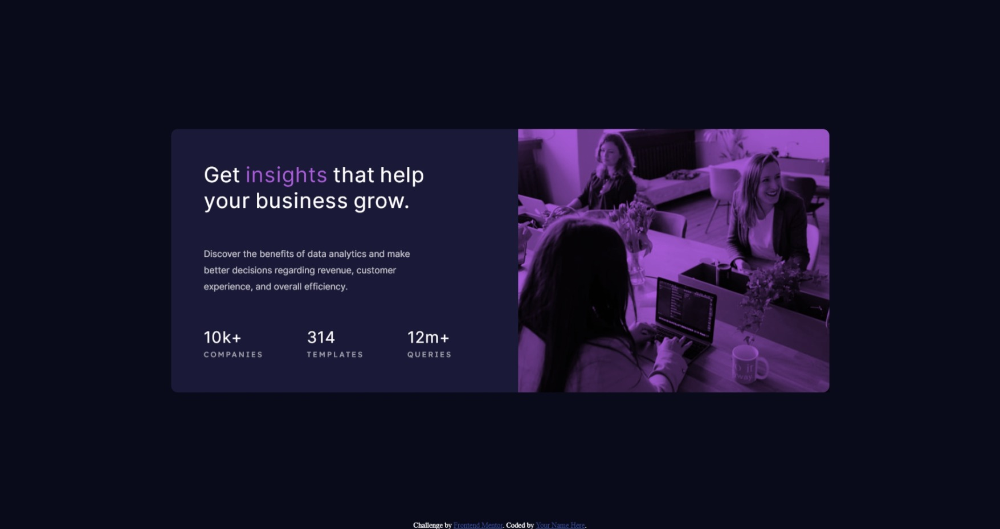

# Frontend Mentor - Stats preview card component solution

This is a solution to the [Stats preview card component challenge on Frontend Mentor](https://www.frontendmentor.io/challenges/stats-preview-card-component-8JqbgoU62). Frontend Mentor challenges help you improve your coding skills by building realistic projects. 

## Table of contents

- [Overview](#overview)
  - [The challenge](#the-challenge)
  - [Screenshot](#screenshot)
  - [Links](#links)
- [My process](#my-process)
  - [Built with](#built-with)
  - [What I learned](#what-i-learned)
  - [Continued development](#continued-development)
  - [Useful resources](#useful-resources)
- [Author](#author)
- [Acknowledgments](#acknowledgments)

**Note: Delete this note and update the table of contents based on what sections you keep.**

## Overview

### The challenge

Users should be able to:

- View the optimal layout depending on their device's screen size

### Screenshot

### Links

- Solution URL: [Solution](https://www.frontendmentor.io/solutions/statspreviewcardcomponentmain-pIerlZE4X)
- Live Site URL: [Live Site](https://octaviusfarrel.github.io/stats-preview-card-component-main/)

## My process

### Built with

- CSS custom properties
- Flexbox

### What I learned

I learned how to use media queries to set display for each resolution.

### Continued development

I will continue learning media queries, it's really tricky to make your website responsive.

### Useful resources

- [Blend mix CSS](https://frontendresource.com/css-background-image-color/) - This helped me with mixing background color from the image with background image

## Author

- Frontend Mentor - [@OctaviusFarrel](https://www.frontendmentor.io/profile/yourusername)
- Twitter - [@Okuta_Jager](https://www.twitter.com/yourusername)

## Acknowledgments

Flexbox is a great tool :D